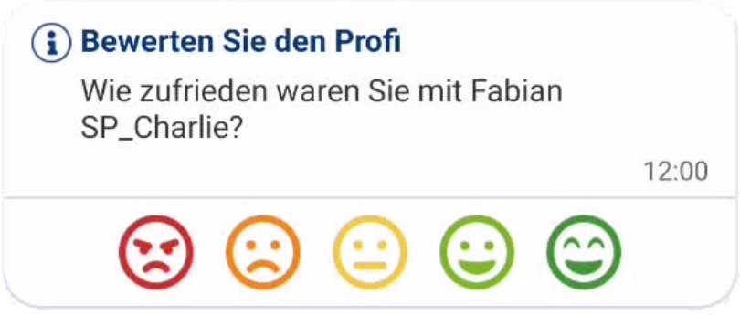

# Reviews

Feel free to adjust the styling of this review message, this is just an example (rating should be 1-5).

The review message is a message type only the customer will see. The service provider gets an information once the customer wrote a review.

## When to display

The service provider should be able to request a review if the quote was accepted at least 7 days ago.

The messages should - as long as they are visible - stay in the chronological order, for reference:

<video style="height: 500px; width: 250px; border-radius: 2px;" controls>
    <source src="./assets/hidden-review-message.mp4" type="video/mp4"/>
    Your browser does not support the video tag.
</video>

    Message gets hidden after writing a review (example)

## Message types/scenario

### Service provider facing messages

"You requested a review from customer XYZ"
- should appear for the service provider once the service provider requested a review
- should hide once the customer wrote the review

"Customer XYZ rated your service with X/5"
- should appear for the service provider once the customer wrote the review

### Customer facing messages

"Service provider XYZ kindly asks you for a review"
- should appear for the customer once the service provider requested a review
- should hide once the customer wrote the review

"You rated service provider XYZ's service with X/5"
- should appear for the customer once he/she wrote the review
