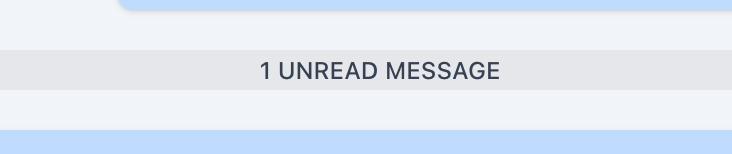

# Unread Banner



Feel free to adjust the styling of this banner, this is just an example.

## Where to display

The unread banner should be displayed between the last read and first unread message addressed to the user (customer/service provider) of the conversation.

Given the following example of *customer facing messages*:

```
Message 1 (Read)
Message 2 (Read)
Message 3 (Not read)
Message 4 (Not read)
Message 5 (Not read)
```

the unread banner should become visible for the customer between message 2 and 3.

## When to display

The unread banner should appear in defined scenarios between messages.

❗️ If an unread banner is visible, the users messenger scroll offset should be set to the unread banner as the first visible message in the chat. 

<table border="1">
    <thead>
        <tr>
            <td style="font-weight: bold;">Case</td>
            <td style="font-weight: bold;">Sub Case</td>
            <td style="font-weight: bold;">Unread Banner</td>
        </tr>
    </thead>
    <tbody>
        <tr>
            <td rowspan="2">User enters screen</td>
            <td>No new messages</td>
            <td>Hidden</td>
        </tr>
        <tr>
            <td>new Messages present</td>
            <td>Visible, view scrolls to unread banner</td>
        </tr>
        <tr>
            <td rowspan="2">Receiving new messages</td>
            <td>Banner was present</td>
            <td>Banner stays where it was originally when entering the screen</td>
        </tr>
        <tr>
            <td>Banner was not present</td>
            <td>Hidden</td>
        </tr>
        <tr>
            <td rowspan="2">Sending new message</td>
            <td>Banner was present</td>
            <td>Hidden</td>
        </tr>
        <tr>
            <td>Banner was not present</td>
            <td>Hidden</td>
        </tr>
    </tbody>
</table>